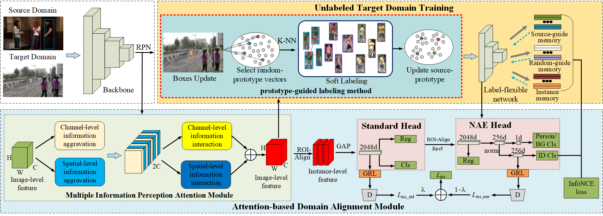

# Fast One-Stage Unsupervised Domain Adaptive Person Search

### [Paper](https://arxiv.org/abs/2405.02832) 
This is the official implementation for our paper Fast One-Stage Unsupervised Domain Adaptive Person Search (FOUS) by Tianxiang Cui, Huibing Wang (corresponding author: huibing.wang@dlmu.edu.cn), Jinjia Peng, Ruoxi Deng, Xianping Fu, Yang Wang. *IJCAI 2024*

## Introduction
In this paper,  we propose a Fast One-stage Unsupervised person Search(FOUS) which complementary integrates domain adaptaion with label adaptaion within an end-to-end manner without iterative clustering. To minimize the domain discrepancy, FOUS introduced an Attention-based Domain Alignment Module (ADAM) which can not only align various domains for both detection and ReID tasks but also construct an attention mechanism to reduce the adverse impacts of low-quality candidates resulting from unsupervised detection. Moreover, to avoid the redundant iterative clustering mode, FOUS adopts a prototype-guided labeling method which minimizes redundant correlation computations for partial samples and assigns noisy coarse label groups efficiently. The coarse label groups will be continuously refined via label-flexible training network with an adaptive selection strategy.


<p align="center">Figure 1. Illustration of the proposed StrDiffusion pipeline.</p>

Performance :
we tried some hyper-parameters and got better ReID performance reported in our paper.

|  Source   |  Target   | mAP  | Top-1 |                             CKPT                             |
| :-------: | :-------: | :--: | :---: | :----------------------------------------------------------: |
|    PRW    | CUHK-SYSU | 78.7 | 80.7  | [ckpt](https://drive.google.com/file/d/1pPAr284Onjl1FsyrVDKwbkhLKg5I-Inm/view?usp=drive_link) |
| CUHK-SYSU |    PRW    | 35.4 | 80.8  | [ckpt](https://drive.google.com/file/d/1c3WHC6ntSMAVl8Ys35ZTaseZFUII6Yj1/view?usp=drive_link) |


## Installation

Install Nvidia [Apex](https://github.com/NVIDIA/apex)

Run `pip install -r requirements.txt` in the root directory of the project.


## Data Preparation

1. Download [CUHK-SYSU](https://drive.google.com/open?id=1z3LsFrJTUeEX3-XjSEJMOBrslxD2T5af) and [PRW](https://goo.gl/2SNesA) datasets, and unzip them.
2. Modify `configs/prw_da.yaml` and `configs/cuhk_sysu_da.yaml` to change the dataset store place (Line 1,5,6) to your own path.


## Citation

If any part of our paper and repository is helpful to your work, please generously cite with:

```
@misc{cui2024fast,
      title={Fast One-Stage Unsupervised Domain Adaptive Person Search}, 
      author={Tianxiang Cui and Huibing Wang and Jinjia Peng and Ruoxi Deng and Xianping Fu and Yang Wang},
      year={2024},
      eprint={2405.02832},
      archivePrefix={arXiv},
      primaryClass={cs.CV}
}
```
