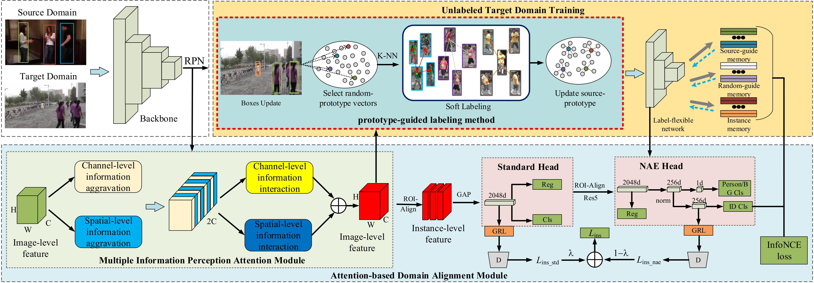

# FOUS
This is the official implementation for our paper Fast One-Stage Unsupervised Domain Adaptive Person Search (FOUS) in IJCAI2024.

## Introduction

Unsupervised person search aims to localize a particular target person from a gallery set of scene images without annotations, which is extremely challengentaing due to the unexpectd variations of the unlabeled domains. However, most existing methods dedicate to developing multi-stage models to adapt domain variations while using clustering for iterative model training, which inevitably increase model complexity. To address this issue, we propose a Fast One-stage Unsupervised person Search (FOUS) which complemryly integrates domain adaption with label adaption within an end-to-end manner without iterative clustering. To minimize the domain discrepancy, FOUS introduced an Attention-based Domain Alignment Module (ADAM) which can not only align various domeains for both detection and ReID tasks but also construct an attention mechanism to reduce the adverse impacts of low-quality candidates resulting from unsupervised detection. Moreover, to avoid the redundant iterative clustering mode, FOUS adopts a prototype-guided labeling method which minimizes redundant correlation computations for partial samples and assigns noisy coarse label groups efficiently. The coarse label groups will be continuously refined via label-flexible training network with an adaptive selection strategy.



|  Source   |  Target   | mAP  | Top-1 |                             CKPT                             |
| :-------: | :-------: | :--: | :---: | :----------------------------------------------------------: |
|    PRW    | CUHK-SYSU | 78.7 | 80.4  | [ckpt]()|
| CUHK-SYSU |    PRW    | 35.4 | 80.8  | [ckpt]()|

## Installation

run `python setup.py develop` to enable SPCL

Install Nvidia [Apex](https://github.com/NVIDIA/apex)

Run `pip install -r requirements.txt` in the root directory of the project.


## Data Preparation

1. Download [CUHK-SYSU](https://drive.google.com/open?id=1z3LsFrJTUeEX3-XjSEJMOBrslxD2T5af) and [PRW](https://goo.gl/2SNesA) datasets, and unzip them.
2. Modify `configs/prw_da.yaml` and `configs/cuhk_sysu_da.yaml` to change the dataset store place (Line 1,5,6) to your own path.

## Testing

1. Following the link in the above table, download our pretrained model to anywhere you like

2. Evaluate its performance by specifing the paths of checkpoint and corresponding configuration file.

PRW as the target domain:

```
python test.py --cfg configs/cuhk_sysu_da.yaml --eval --ckpt $MODEL_PATH
```

CUHK-SYSU as the target domain:

```
python test.py --cfg configs/prw_da.yaml --eval --ckpt $MODEL_PATH
```
